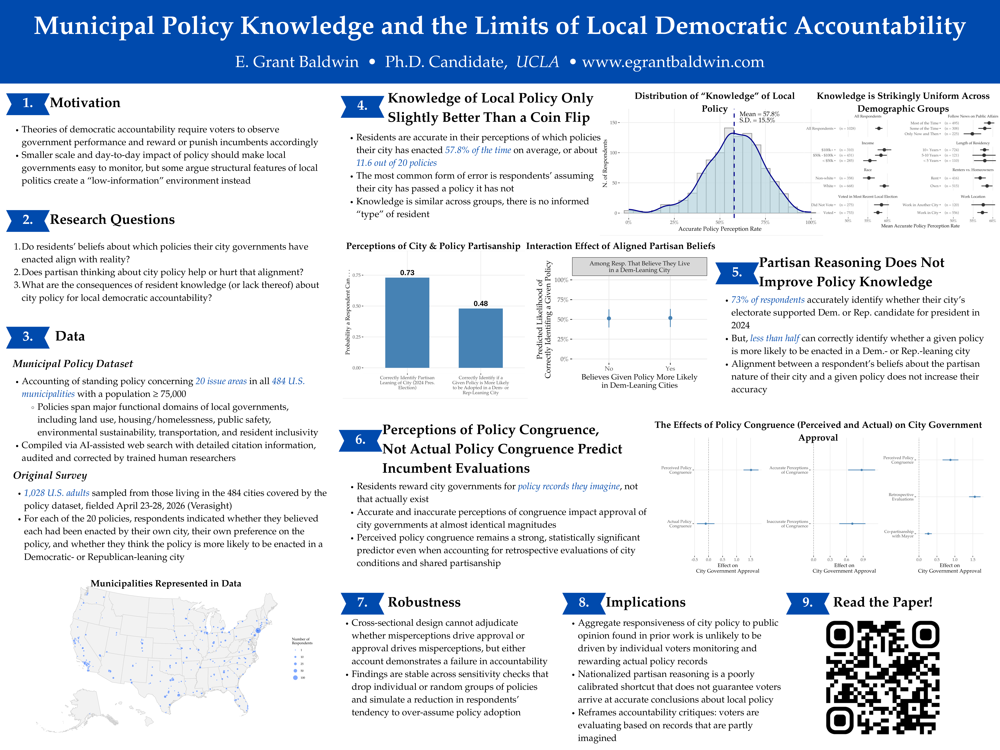

## Job Market Paper

::::::: research-item
::: research-title
Municipal Policy Knowledge and the Limits of Democratic Accountability
:::

:::: research-links
[Read Current Version](files/Baldwin_Job_Market_Paper.pdf)

Abstract

::: abstract-body
Theories of democratic accountability expect voters to observe government performance to reward or punish incumbents accordingly. This paper asks whether residents can accurately identify the policies enacted by their city governments, whether partisan reasoning helps or hurts that accuracy, and what the consequences of voters’ municipal policy knowledge are for democratic accountability. Linking an original survey of over 1,000 American city residents to a comprehensive accounting of the policy decisions of 321 city governments on 20 issues, I show that residents are only marginally better at accurately identifying their city governments’ policy than chance, with errors skewing toward over-assuming government action. Partisan reasoning ultimately undermines accuracy because most residents cannot correctly identify which policies are more likely to be enacted in Democratic and Republican cities. Residents reward and punish their city governments based on their perceptions of congruence between city policy and their preferences, regardless of whether those perceptions match reality. These findings suggest that even in an era of nationalized politics, most residents are unable to use partisan reasoning to substitute for direct knowledge of local policy, and that frequent misperceptions of city government action hold real consequences for local democratic accountability.
:::

View Poster Version

::: abstract-body
[{width=100%}](files/LPEC_Poster.pdf)
:::

::::
:::::::

------------------------------------------------------------------------

# *The Supply and Demand of Municipal Policy in a Polarized Era*

Advised by Chris Tausanovitch, Julia Payson, Lynn Vavreck, and Daniel Thompson

In my dissertation, I compile new data on the policymaking histories of hundreds of U.S. cities which I then combine with an original survey to study voters’ knowledge of the policies enacted by their city governments and how that knowledge (or lack thereof) shapes local political accountability.

In its first paper, the dissertation introduces a novel dataset which tracks the policymaking histories of all 484 U.S. municipalities with populations over 75,000. This dataset covers 90 distinct policies spanning 10 domains of local governance, including land use and zoning, housing and homelessness, public safety, transportation infrastructure, and environmental sustainability. In its current state, it documents more than 23,000 policy actions made by city governments stretching back as early as the 19th century until early 2026. These data serve as the empirical foundation for the remainder of the dissertation and an emerging research agenda on local governance and policymaking more broadly. They also offer a resource that future scholars can use to track policy change, compare jurisdictions, and test theories of local governance at scale. Once completed, the dataset will be made publicly available on my website.

The second paper, my job market paper, “Municipal Policy Knowledge and the Limits of Local Democratic Accountability,” uses this novel dataset as ground truth to study whether city residents know what policies their city governments have enacted, and whether that knowledge shapes political accountability. Pairing the policy data with an original survey of city residents, I find that respondents identify their city’s policies only marginally better than chance would predict, with errors skewing toward assuming government action that has not occurred. I show that partisan reasoning about city policy ultimately undermines knowledge of local policy because most respondents cannot correctly identify which policies are more likely to be enacted in Democratic and Republican cities. Even more, voters’ perceptions of city policy has real consequences for local democratic accountability: residents reward or punish local officials based on their perceptions of congruence between city policy and their preferences, regardless of whether those perceptions match reality.

The third paper examines the extent to which municipal finances are responsive to the outcomes of elections. Using a regression discontinuity design around close mayoral elections, I test whether a change in mayoral administrations produces measurable shifts in how funds are distributed across city budgets. I find largely null effects across all spending categories, suggesting that challengers that unseat incumbents do not shift public funds any more than re-elected incumbents. This finding suggests that even in conditions where voters express desires for change by ousting incumbents, the resulting change in governance is minimal.