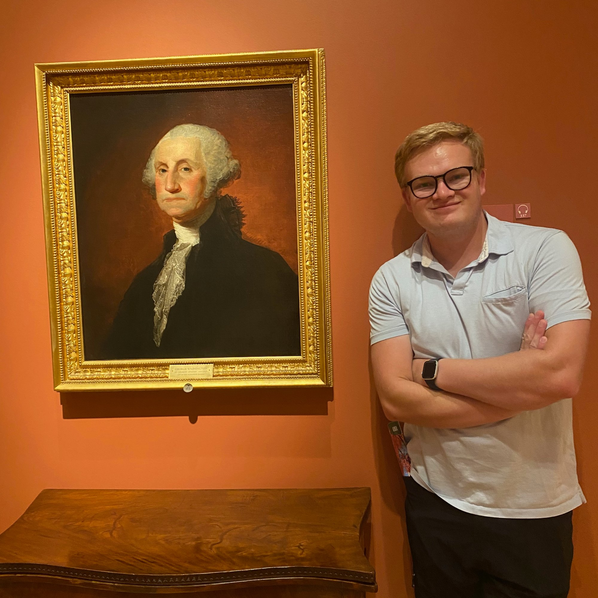

```{=html}
<style>
  /* Hide the auto-rendered "Bio & CV" title on this page only */
  h1.title { display: none; }
  #title-block-header { display: none; }
</style>
```

# E. Grant Baldwin

::::: bio-container
::: bio-photo
{fig-alt="E. Grant Baldwin"}

```{=html}
<div class="bio-links">
  <div>📍 Los Angeles, CA</div>
  <div>📩 <a href="mailto:baldwinegrant@g.ucla.edu">baldwinegrant@g.ucla.edu</a></div>
  <div>🔗 <a href="https://polisci.ucla.edu/person/grant-baldwin/">Department Profile</a></div>
  <div>🎓 <a href="https://scholar.google.com/citations?user=aNPofzkAAAAJ&hl=en&oi=ao">Google Scholar</a></div>
  <div>🪪 <a href="https://orcid.org/0000-0003-0825-7452">ORCID</a></div>
</div>
```
:::

::: bio-text
I am a Ph.D. Candidate in Political Science at the [University of California, Los Angeles](https://polisci.ucla.edu). My research investigates the relationship between public opinion, elections, and public policy in the U.S. with a particular focus on the “low information” environments of city and state governments.

My dissertation — [*The Supply and Demand of Municipal Policy in a Polarized Era*](dissertation.qmd) — asks how much voters know about the policy choices of their city governments and whether that knowledge (or lack thereof) strengthens or hinders government accountability. To answer this, I track the policymaking behavior of 484 U.S. cities across 90 issue domains over time and conduct an original survey to test voters' knowledge of their cities' policy choices.

My work has been published in [*Urban Affairs Review*](https://journals.sagepub.com/doi/full/10.1177/10780874251414062) and has been supported financially by the [Institute for Humane Studies](https://theihs.org), the [Urban Communication Foundation](https://urbancomm.org), and the [UCLA Institute to Study Hate](https://studyofhate.ucla.edu).

[Download CV](files/cv.pdf){.btn-cv}

I am on the 2026-2027 cycle of the academic job market. Click [here](dissertation.qmd##job-market-paper) to read my job market paper.
:::
:::::

------------------------------------------------------------------------

### Education

::: cv-entry
**University of California, Los Angeles**\
Ph.D. Political Science, Anticipated 2027

-   Dissertation: *The Supply and Demand of Municipal Policy in a Polarized Era*
-   Committee: Chris Tausanovitch (chair), Julia Payson, Dan Thompson, and Lynn Vavreck

M.A. Political Science, 2025
:::

::: cv-entry
**Brigham Young University**\
B.A. Political Science, 2022

-   Minors in History and Civic Engagement Leadership
:::

------------------------------------------------------------------------

::: photo-aside-center
{fig-alt="Grant standing next to a portrait of George Washington at a museum" width="340"}
:::
