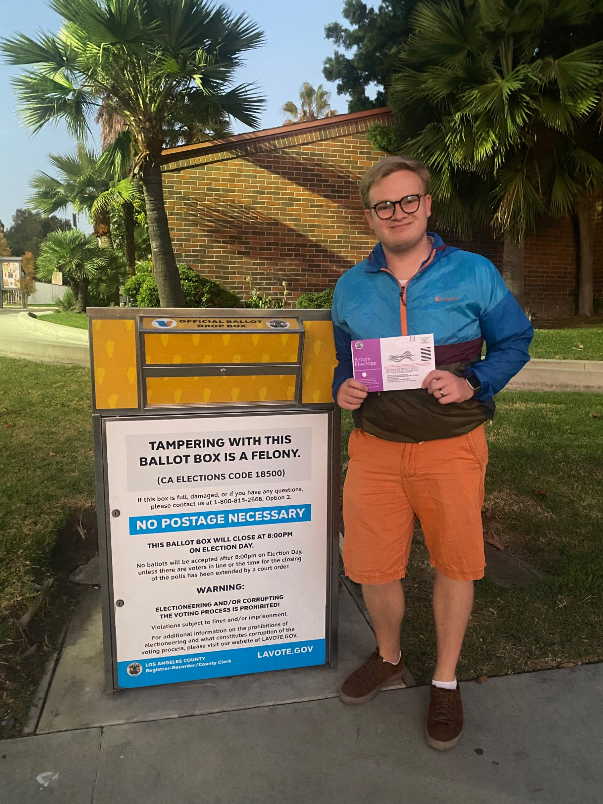

I study local (primarily cities) and state politics in the United States. My research examines how information and institutions shape the decisions of both voters and officials in "low-visibility" electoral and policymaking contexts, spanning topics in representation & accountability, voting behavior, public opinion, political geography and racial/ethnic politics.

[Download CV](files/cv.pdf){.btn-cv}

------------------------------------------------------------------------

### Peer-Reviewed Articles

::::::: research-item
::: research-title
When Cues Collide: Partisan Signals and the Dynamics of Ethnic Voting in Nonpartisan Local Elections
:::

::: research-journal
*Urban Affairs Review* 0(0): 1–35. (OnlineFirst, 2026)
:::

:::: research-links
[Published version](https://doi.org/10.1177/10780874251414062) \| [Replication data](https://doi.org/10.7910/DVN/Q2J7QF)

Abstract

::: abstract-body
Voters often use candidate ethnicity as a shortcut in low-information elections, but partisan cues might shift the weight of ethnic signals. This article examines how partisan information moderates the relationship between co-ethnicity and vote choice in 103 multiethnic, nonpartisan mayoral elections in California (2010–2021). Using precinct-level election returns and voter registration data, I find that Latino candidates receive greater support as the share of Latino registrants in a precinct increases — but this relationship changes when party information is revealed. When facing a known non-Latino Democrat, Latino candidates receive less support than their nonpartisan counterparts; when facing a known non-Latino Republican, they gain support. These effects are strongest in precincts with more Latino Democrats. The findings highlight how party cues reshape ethnic voting, even without formal partisan labels.
:::

::::
:::::::

------------------------------------------------------------------------

### Articles Under Review

::::: research-item
::: research-title
The Boy-Who-Cried-Wolf Effect: Examining the Consequences of Contentious Allegations of Prejudice
:::

::: research-journal
With Clayton Becker, Josh Goetz, Ananya Hariharan, Emily Ortiz, and Connor Warshauer. Under review.
:::

:::: research-links
[Blog Post](https://studyofhate.ucla.edu/benefit-or-backlash-examining-the-effect-of-contentious-claims-of-antisemitism/)

::::
:::::

::::: research-item
::: research-title
Economic Self-Interest and Support for Redistribution: New Evidence Using Election Results Data
:::

::: research-journal
With Jieun Lee, Ben Newman, and G. Agustin Markarian. Invited to revise and resubmit at American Political Science Review.
:::
:::::

------------------------------------------------------------------------

### Papers in Progress

::::: research-item
::: research-title
How Responsive is US Municipal Fiscal Policy to Residents' Partisanship Across Time and Even in Small Towns?
:::

::: research-journal
With Adam Dynes and Graham Strauss. Working paper.
:::
:::::

------------------------------------------------------------------------

::: photo-aside-center
{fig-alt="Grant standing next to an official ballot drop box in Los Angeles" width="340"}
:::
