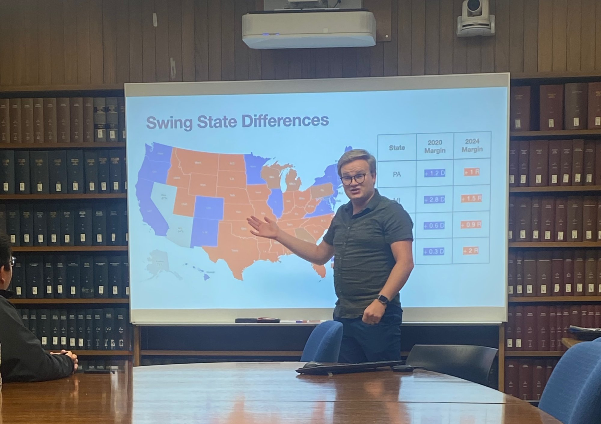

### As Instructor

:::: teaching-item
::: course-code
Pol Sci 149: State, Local, and Spatial Politics
:::

UCLA — Summer 2026
::::

:::: teaching-item
::: course-code
Pol Sci 40: Introduction to American Politics
:::

UCLA — Summer 2024

[Syllabus](files/PS 40 SSC 2024 Syllabus.pdf)
::::

------------------------------------------------------------------------

### As Teaching Assistant

:::: teaching-item
::: course-code
Pol Sci 40: Introduction to American Politics
:::

UCLA — Fall 2023, Fall 2024, Winter 2025
::::

:::: teaching-item
::: course-code
Pol Sci M141A: Political Psychology
:::

UCLA — Spring 2024
::::

:::: teaching-item
::: course-code
A Htg 100: American Heritage
:::

BYU — Fall 2019, Winter 2020, Fall 2020, Winter 2021, Fall 2021, Winter 2022
::::

:::: teaching-item
::: course-code
Poli 110: Introduction to American Politics
:::

BYU — Spring 2020
::::

------------------------------------------------------------------------

::: photo-aside-center
{fig-alt="Grant presenting a slide on swing state differences in a seminar room" width="510"}
:::
